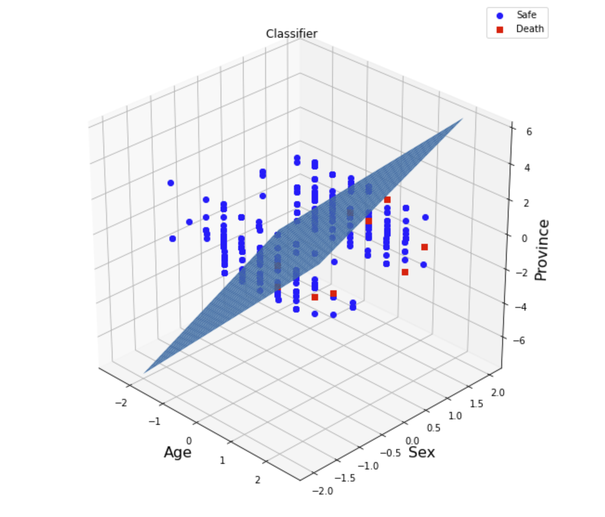

# Predicting Covid Mortality with Machine Learning.
> The aim of this project is to predict mortality among confirmed CoVID-19 patients in South Korea using logistic regression and support vector machines. 
Compare both models and identify best among them. 

## Table of contents
* [General info](#general-info)
* [Technologies](#technologies)
* [Features](#features)
* [Results](#results)
* [Conclusion](#conclusion)

## General info
Add more general information about project. What the purpose of the project is? Motivation?

## Technologies
* Tech 1 - version 1.0
* Tech 2 - version 2.0
* Tech 3 - version 3.0

## Features
List of features ready and TODOs for future development
* Awesome feature 1
* Awesome feature 2
* Awesome feature 3

## Results

## Conclusion
Created by [@flynerdpl](https://www.flynerd.pl/) - feel free to contact me!
